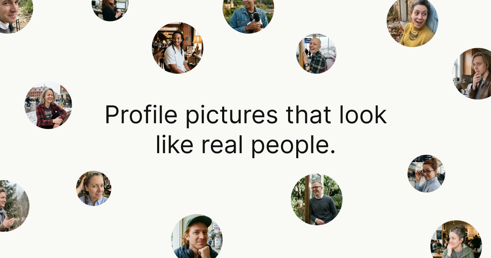

# RealPFP

**Realistic AI profile pictures that don't look AI-generated.**

Free, open-source, and private — you bring your own [fal.ai](https://fal.ai) key and it never leaves your browser.

Live at **[realpfp.vercel.app](https://realpfp.vercel.app)**



## What it does

Pick a look, dial in who and what appears, and generate as many profile pictures as you like. The prompts are tuned to dodge the usual AI tells — plastic skin, mangled hands, garbled text, every face dead-centre.

- **Three looks** — *Aspirational* (polished but real), *Profile picture* (natural, postable), *Authentic candid* (documentary, imperfect).
- **Control the people** — sliders for ethnicity and gender distribution, or an even random mix.
- **Control the details** — how often glasses, jewellery, hats, pets, named locations and more show up.
- **Coherent scenes** — time of day, weather and light always agree (no smiling in a thunderstorm).
- **Batch & export** — generate in bulk, save favourites, download a single image or a ZIP.

## Run it locally

You'll need [Node.js](https://nodejs.org) and a free [fal.ai key](https://fal.ai/dashboard/keys).

```bash
git clone https://github.com/heyimjames/RealPFP.git
cd RealPFP
npm install
npm run dev
```

Open **[localhost:2929](http://localhost:2929)**, hit **Settings**, and paste your fal.ai key. It's stored only in your browser and sent nowhere except fal.ai.

## How it works

Every image builds a detailed, randomised prompt from your settings — traits, scene, lighting, camera, framing — written as natural description and sent to fal.ai's `nano-banana-2` model. The prompt logic leans on *positive* description (what real photos actually have: pore texture, one light source, correct anatomy) rather than negation, which is what keeps results from looking synthetic.

## Tech

Next.js · React · TypeScript · Tailwind CSS · fal.ai · Vercel

## License

[MIT](LICENSE) © James Frewin
